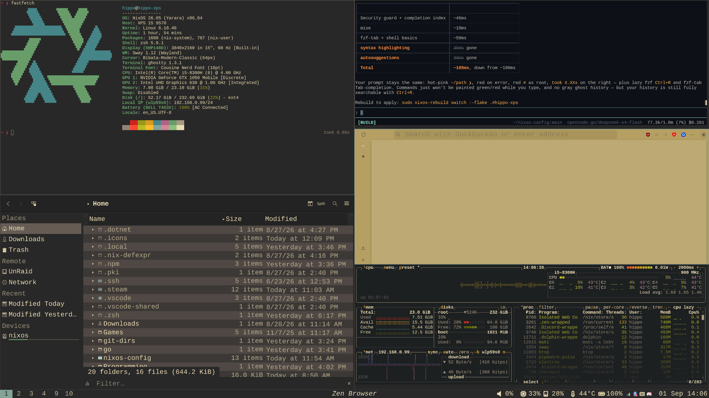

# hippo-xps — NixOS configuration

A complete, reproducible desktop: **sway (Wayland) + zsh**, gruvbox-themed with a
hot-pink accent, built for an XPS 15 9570 (4K panel, Intel GPU rendering, 1050 Ti
disabled).



## What's in here

- **Sway** — tiling WM, vim-direction focus, custom keybinding digests (`$mod+F1`)
- **Waybar / mako / fuzzel / swayosd / kanshi** — bar, notifications, launcher,
  OSD, per-monitor layout
- **zsh** — bare prompt (hot-pink `❯`), fzf-tab fuzzy Tab, lazy fzf `Ctrl+R`
  history, no prompt framework
- **GTK/Qt theming** — kvantum Qt + gruvbox GTK, recolored **hot-pink cursor**
  shared by session and greeter, regreet login
- **Apps** — Ghostty, VS Code/Neovim, qalculate, Dolphin (NAS/SMB), Zen browser,
  pavucontrol/blueman popups, Steam + Proton GE, Dolphin emulator + **joycond**
  (combined Joy-Cons), fcitx5 pinyin IME
- **Hardware** — keyd caps→escape, TLP power, Intel Wi-Fi/BT firmware,
  `hid_nintendo` driver, iGPU-only rendering

## Packaging: NixOS vs mise — which goes where?

Two package managers live here, and the split is deliberate:

| Concern | System |
|---|---|
| **The desktop itself** — kernel, services, sway, theming, desktop + system packages | **NixOS** (`modules/*`, `configuration.nix`) — declared once, rebuilds atomically |
| **User-level dev tools you bump constantly** — `opencode`, `maki`, `yt-dlp`, `deno`, `golang` | **mise** (`home/default.nix` → `programs.mise`, tools in `mise/config.toml`) |

The rule of thumb: **part of the environment → Nix; a tool in your toolbox
that you update weekly and version per project → mise.** Pinning bleeding-edge
CLIs in the Nix closure would slow every rebuild for zero gain — mise gives
per-tool/per-project versions without touching the system.

## The point of this repo: make it *yours* in two files

This config was designed so a different machine gets a fresh look **without
hunting through files**. Two files are the entire surface:

| File | What it controls |
|---|---|
| **`modules/theming.nix`** | every color (full Gruvbox palette + the hot-pink accent), GTK/Qt theme names, cursor theme, wallpaper |
| **`modules/sizing.nix`** | **one big file for ALL sizing**: fonts (sway/waybar/mako/ghostty), display scales (global Qt, per-app GTK), cursor sizes, floating popup anchors (pavucontrol/blueman), bar sizes |

Sway, Waybar, Mako, Ghostty and the per-app GTK/Qt env all read from those two
files — change a number, rebuild, done.

Per-monitor placement is the one thing NOT in `sizing.nix`: that's
`home/kanshi/config` (it maps outputs to *your* desks, not a global scale).

## Reproducing on your own hardware

1. Clone and enter the repo.
2. **Generate your hardware config**: `sudo nixos-generate-config --root /` and
   copy the resulting `hardware-configuration.nix` over the one here (mine is
   XPS-9570-specific).
3. **Look the part**: edit `modules/theming.nix` and `modules/sizing.nix`
   (screen size → scales; taste → colors). Adjust `home/kanshi/config`.
4. **You**: if your username isn't `hippo`, update `users.users.hippo` in
   `modules/base.nix` and `home.username` in `home/default.nix`.
5. Build: `sudo nixos-rebuild switch --flake .#hippo-xps`

## Keybindings (`$mod` = Super/Windows key)

Sway is near-stock — everything not listed here keeps its stock default
(`$mod+Return` terminal, `$mod+d` menu, `$mod+Shift+q` kill, `$mod+f`
fullscreen, `$mod+r` resize mode, workspaces/scratchpad, …).

### Resolution presets — `$mod+F10/F11/F12`

Intended for games/streaming on the 4K panel. The iGPU composites at the low
resolution and the panel's fixed scaler upscales to 3840×2160 — so every
framebuffer px is 2 (1080p) or 3 (720p) physical px. `set-res.sh` re-derives
**everything** per preset from `modules/sizing.nix` (`presets`) and applies it
live: fonts (sway/waybar/mako/ghostty/GTK/swayosd), bar size, notification
margins, cursor size, mouse speed, popup anchors — open terminals even update
in place (ghostty SIGUSR2 config reload).

| Key | Resolution | Use |
|---|---|---|
| `$mod+F10` | 1280×720 | native game play |
| `$mod+F11` | 1920×1080 | game streaming |
| `$mod+F12` | 3840×2160 (EDID) | normal desktop |

Note: a terminal that was manually zoomed (`Ctrl+=`/`Ctrl+-`) drops out of the
font cascade — press `Ctrl+0` in it (reset font size) to rejoin.

### Help & utilities

| Key | Action |
|---|---|
| `$mod+F1` | searchable keybind overview (`keys.sh` → fuzzel `--dmenu`) |
| `$mod+n` | notification history (mako buffer via fuzzel viewer) |
| `$mod+o` | wlsunset nightlight toggle (warm orange ~4000K, no timer) |
| `$mod+Shift+Return` | new Zen browser window |
| `$mod+b` | blueman bluetooth manager (2×-scaled floating popup) |

### IME (works in every app)

| Key | Action |
|---|---|
| `$mod+Shift+t` | toggle English ⇄ Pinyin (fcitx5; sway intercepts before the app, so VS Code/Electron have no blind spot) |

### Screenshots — clipboard-only (Windows-snipping style)

| Key | Action |
|---|---|
| `Print` | whole screen → clipboard |
| `Ctrl+Print` | focused window → clipboard |
| `$mod+Shift+s` | snip: rectangle select with **live pixel measurements** |

### Focus, move & splits — vim directions

`$mod+h/j/k/l` = focus left/down/up/right (**`$mod+h` is *not* split** — it was
rebound when focus went vim; arrows work too). Move windows with
`$mod+Shift+h/j/k/l`. Consequences: `$mod+semicolon` = horizontal split, and
`$mod+v` = vertical split (stock). The resize mode (`$mod+r`) also uses vim
keys.

### Hardware keys & other bindings

- `XF86Audio*` / `XF86MonBrightness*` → swayosd on-screen popups;
  play/pause/next/prev → playerctl.
- caps → Esc via `keyd` (system-wide).
- `$mod+Shift+e` quits sway (confirmation nag); `$mod+Shift+c` reloads config.
- Window rules: Signal/Discord → workspace 9, Slack → 8; pavucontrol/blueman
  float as 2×-scaled popups anchored to their tray icons; Dolphin dialogs float.
- Bar sits at the **bottom**; focus follows mouse; the cursor never auto-hides.

## Layout

```
flake.nix               # entry: nixpkgs pins, system, home-manager
configuration.nix       # machine-level glue (env vars via theming/sizing)
modules/
  base.nix              # system packages, users, ssh, basics
  hardware.nix          # XPS-specific: kernel modules, firmware, TLP, BT
  theming.nix           # ← ALL colors/theme choices (pure data)
  sizing.nix            # ← ONE BIG FILE: all fonts/scales/anchors (pure data)
  desktop.nix           # sway/regreet/GTK+Qt theming plumbing
  apps.nix dev.nix audio.nix gaming.nix
home/
  default.nix           # home-manager: shells, scripts, dotfiles wiring
  sway/ waybar/ mako/ ghostty/ fuzzel/ kanshi/ swayosd/ cursor/ kvantum/
```

## Public-repo hygiene

- No secrets in the tree: only a commented-out example proxy line.
- `cont_maki.sh` (a maki session helper) is gitignored; it existed in early
  commits, so if you want it gone from *history* too, purge with
  `git filter-repo` (rewrites SHAs — one-time, then force-push).
- Screenshots live in `images/` — replace `desktop-screenshot-1.png` to taste.

## Roadmap-ish (deliberately small)

- `home/swayosd/style.css` still holds its px values literally (follows
  `sizing.nix`'s `display.osd` — bump them together); converting it to a fully
  generated file is optional.
- Neovim + VS Code ship stock configs; a real nvim setup is future work.